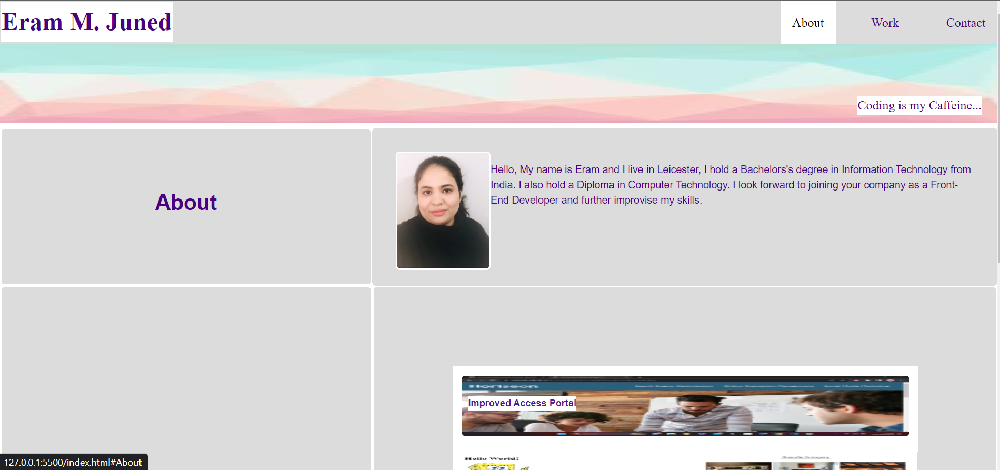
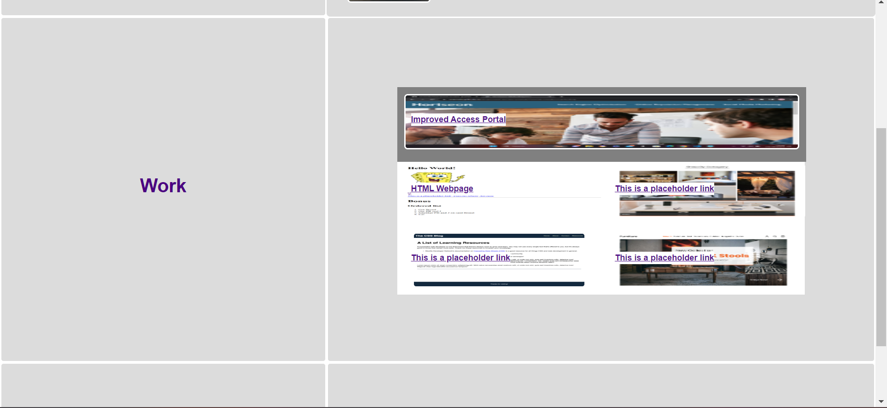

# front-end-expert-portfolio
This project is a my portfolio webpage for "Front-End Developer Profile Webpage".
It consists of a header, navigation bar, a grid layout for the main section and a footer.

# header 
this contains a name and is overlapping the navigation bar using the position absolute code.

# navigation bar 
this contains 3 sections using the unordered list: about work and contact.
when clicked the webpage scrolls to the respective section.

# grid layout
the grid layout is divided into 6 sections using the grid-template-columns and grid-template-rows and 1fr code.
there is a nested grid layout inside the "work-info" section.
this grid displays project screenshots and are titled with a link to the gitHub repository.
(two projects are live rest links are placeholders).

# footer
this contains 6 options for all the different contact and social media pages.
when clicked a new page opens with the respective website (except phone).

# screenshots of the website:

# repository name: front-end-expert-portfolio

# github link: https://eramsk.github.io/front-end-expert-portfolio/
